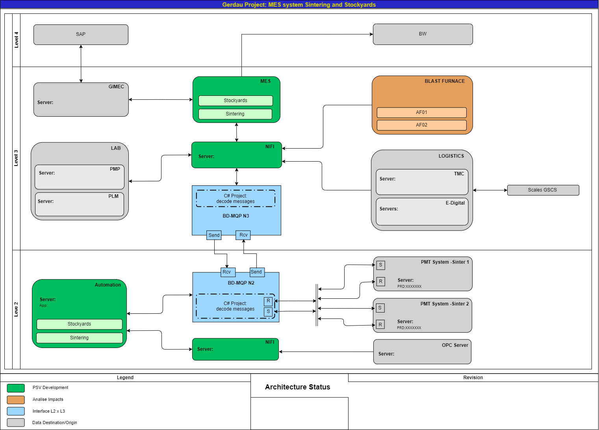
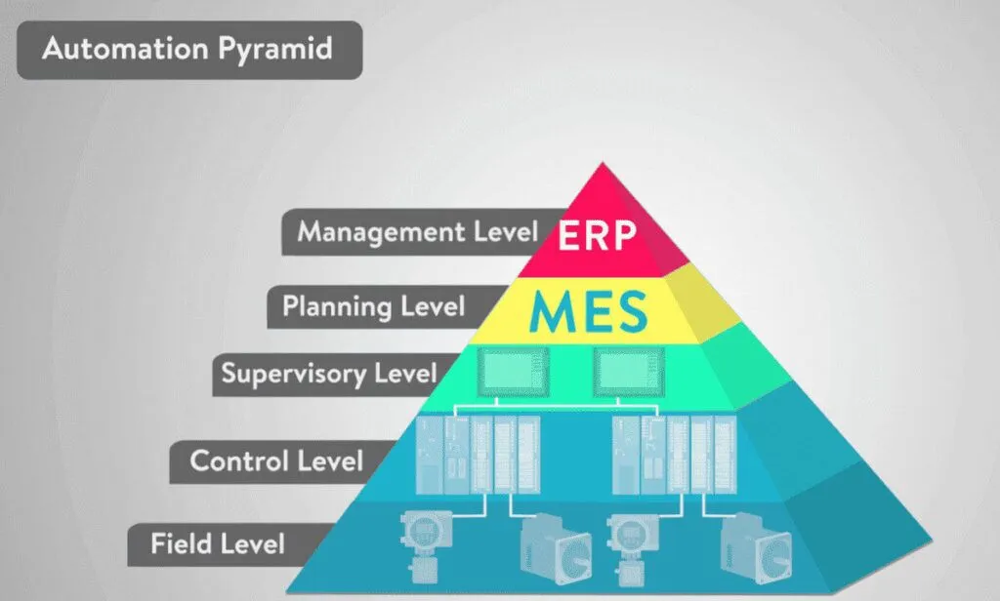
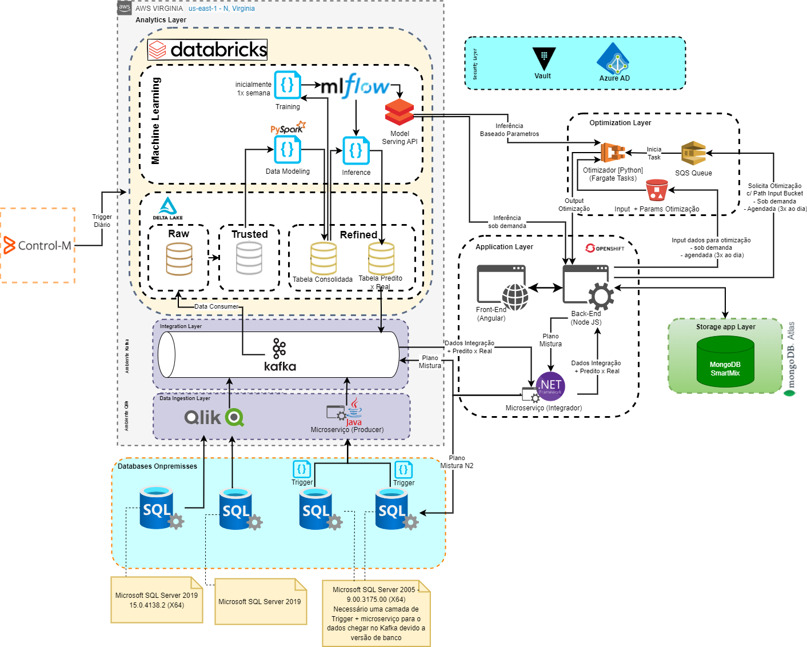

# Project Setup and Execution Guide  
[Portuguese Version](README.pt-br.md)  

This guide will help you set up and run the application using Docker Compose.  

## Prerequisites  

Make sure you have the following programs installed on your system:  
- [Docker](https://www.docker.com/get-started)  
- [Docker Compose](https://docs.docker.com/compose/install/)  

## Starting the Project  

### 1. Clone the Repository  
```sh
git clone https://github.com/AlexandreRra/ALEXANDRE_AMORIM_DDF_TECH_022025
cd <your-project-directory>
```  

### 2. Configure Environment Variables  
Modify the `docker-compose.yml` file to use your [Kaggle API token](https://www.kaggle.com/docs/api#getting-started-installation-&-authentication) for downloading the dataset. Update the following fields in `docker-compose.yml`:  

```
services
|
|---api
|    |
|    |---environment
|    |    |
|    |    |---KAGGLE_KEY: <your key>
|    |    |---KAGGLE_USERNAME: <your username>
```  

If you do not want to use the Kaggle API, you can download the dataset `.zip` file directly from [this link](https://www.kaggle.com/datasets/piyushjain16/amazon-product-data) and place it in the `./backend` folder. This way, the application will skip the download step and proceed directly to data ingestion and cleaning.  

The dataset contains over 2 million rows and is about 1.5GB in size. Therefore, the data ingestion process into PostgreSQL (only on the first run) may take some time (around 5 minutes).  

### 3. Build and Run the Containers  
Run the following command in the project's root directory:  
```sh
docker-compose up --build
```  
This will build and start the following services:  
- **PostgreSQL Database** (Port: `5432`)  
- **Flask API** (Port: `5000`)  
- **React Frontend** (Port: `3000`)  

### 4. Access the Application  
- **Frontend:** Open `http://localhost:3000` in your browser.  
- **API:** Open `http://localhost:5000` in your browser or test it using a tool like Postman.  
- **Swagger Documentation:** Open `http://localhost:5000/apidocs` in your browser.  
- **Database:** Connect using `localhost:5432`, `myuser`, `mypassword`, and `mydatabase`.  

## Stopping the Application  
To stop the application and remove the containers, use:  
```sh
docker-compose down
```  

## Additional Commands  
- To rebuild without using the cache:  
  ```sh
  docker-compose up --build --force-recreate
  ```  
- To run in detached mode (in the background):  
  ```sh
  docker-compose up -d
  ```  
- To check logs:  
  ```sh
  docker-compose logs -f
  ```  

## Troubleshooting  
- Ensure that Docker is running before executing `docker-compose` commands.  
- If there are port conflicts, change the ports in `docker-compose.yml`.  

## Notes  
- **Database Persistence:** The data is stored in a Docker volume (`postgres_data`).  
- **Hot Reloading:** Changes in the backend and frontend should be reflected without needing to restart the containers.  

# Previous Experiences
Here I will describe my last two experiences as a full-stack developer within the largest Gerdau plant in the world.

## MPS - MES, Yards, and Sintering


In this project, the goal was to replace three legacy systems (built in VB) with a new one while maintaining all existing integrations. Above is the architecture, showing the entire data flow between the plant's levels.


At Level 2, where yard control is located (Control Level):
- Truck entry via road and railway
- Inventory management
- Pile formation
- Pile quality (laboratory integration with weighted average of receipts)
- Material movement between areas
- Control data visualization
- SAP reconciliation

At Level 3, sintering (MES):
- Shift closure
- Control data visualization
- SAP reconciliation

I was responsible for the entire project structure, developing the frontend (Angular), backend (.NET), SQL Server, integrations (MQP - Gerdau internal messaging .NET), and Apache NiFi. I led discussions with the business team to understand and define features/scope. The entire structure was on-premise on Gerdau IIS servers within the plant itself.

## Smartmix


In this project, I had the opportunity to work on a cloud-based project focused on deploying Gerdau's Digital Twin.

In the coke plant area, where the coal mixture used to produce coke can be highly volatile and depends on significant imports of the commodity, leading to high costs.

The focus was on training a model with historical data on coal quality and coke results to make predictions based on the current mixture. An optimizer was also implemented, running the prediction in a loop, guided by predefined quality ranges, aiming to reduce the mixture's cost.

With this optimization and prediction, it was possible to reduce costs by around R$ 50.00 per ton of coal. Given that approximately 5kt is used per day, this resulted in a monthly savings of R$ 7.5 million, as the plant operates 24/7.

My role was also to lead the project, so I participated in each architectural stage, from configuring triggers (Java) to data arrival in Databricks and creating jobs/workflows for the refined layer. My main work was in ROSA, with frontend (Angular), backend (Node.js Express), and MongoDB. I also implemented AWS integration (ECS), where the optimizers were hosted. In Databricks, I worked with PySpark and machine dimensioning to reduce costs.

I developed the .NET integrator to consume Kafka streaming data, using a single function and parameterizing any topic (input) and API (output) through a YAML configuration.