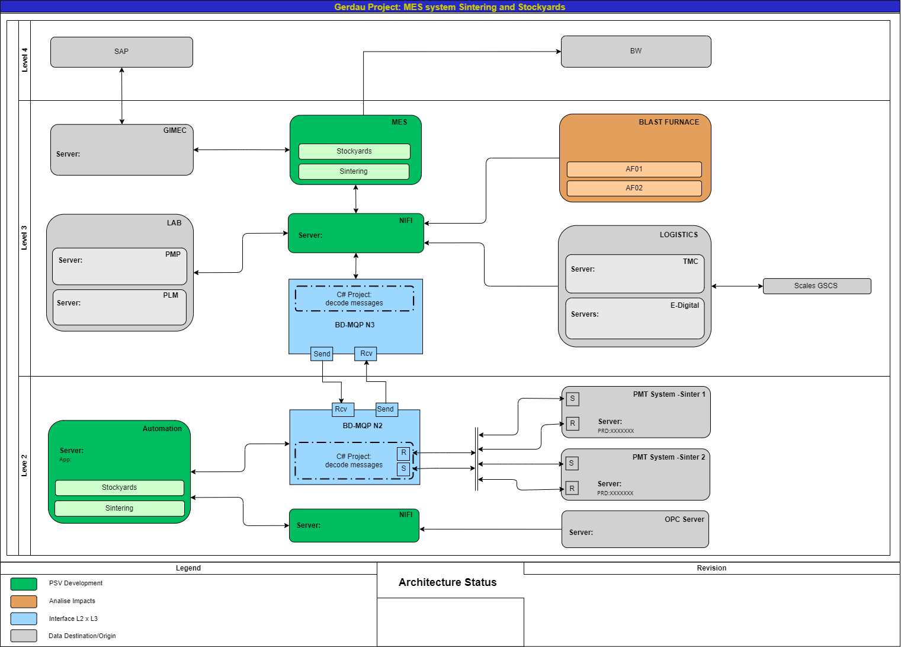
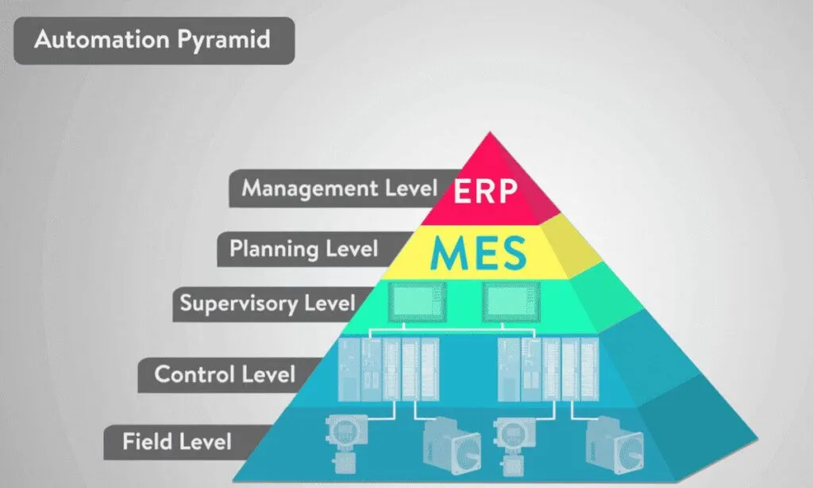

# Guia de Configuração e Execução do Projeto
[Versão em Inglês](README.md)

Este guia ajudará você a configurar e executar a aplicação usando Docker Compose.

## Pré-requisitos

Certifique-se de ter os seguintes programas instalados no seu sistema:
- [Docker](https://www.docker.com/get-started)
- [Docker Compose](https://docs.docker.com/compose/install/)

## Iniciando o Projeto

### 1. Clonar o Repositório
```sh
git clone https://github.com/AlexandreRra/ALEXANDRE_AMORIM_DDF_TECH_022025
cd <seu-diretório-do-projeto>
```

### 2. Configurar Variáveis de Ambiente
Modifique o arquivo `docker-compose.yml` para utilizar seu [token](https://www.kaggle.com/docs/api#getting-started-installation-&-authentication) de acesso à API da kaggle para download do dataset. Altere os seguintes campos no `docker-compose.yml`:

```
services
|
|---api
|    |
|    |---environment
|    |    |
|    |    |---KAGGLE_KEY: <sua chave>
|    |    |---KAGGLE_USERNAME: <seu usuário>
```

Caso não queria utilizar a API do kaggle, é possível baixar diretamente o .zip do [dataset](https://www.kaggle.com/datasets/piyushjain16/amazon-product-data) e colocá-lo na pasta `./backend`. Assim a aplicação pulará a parte do download e fará apenas a ingestão e limpeza dos dados.

O dataset tem mais de 2 milhões de linhas e cerca de 1.5GB, por isso a ingestão de dados para o Postgres(Apenas na primeira execução) pode levar um tempo (cerca de 5 minutos).

### 3. Construir e Executar os Containers
Execute o seguinte comando no diretório raiz do projeto:
```sh
docker-compose up --build
```
Isso construirá e iniciará os seguintes serviços:
- **Banco de Dados PostgreSQL** (Porta: `5432`)
- **API Flask** (Porta: `5000`)
- **Frontend React** (Porta: `3000`)

### 4. Acessar a Aplicação
- **Frontend:** Abra `http://localhost:3000` no seu navegador.
- **API:** Abra `http://localhost:5000` no navegador ou teste com uma ferramenta como Postman.
- **Swagger:** Abra `http://localhost:5000/apidocs` no navegador.
- **Banco de Dados:** Conecte-se usando `localhost:5432`, `myuser`, `mypassword` e `mydatabase`.

## Parando a Aplicação
Para parar a aplicação e remover os containers, use:
```sh
docker-compose down
```

## Comandos Adicionais
- Para reconstruir sem usar cache:
  ```sh
  docker-compose up --build --force-recreate
  ```
- Para rodar em modo desacoplado (em segundo plano):
  ```sh
  docker-compose up -d
  ```
- Para verificar os logs:
  ```sh
  docker-compose logs -f
  ```

## Solução de Problemas
- Certifique-se de que o Docker está em execução antes de executar os comandos `docker-compose`.
- Se houver conflitos de porta, altere as portas no `docker-compose.yml`.

## Notas
- **Persistência do Banco de Dados:** Os dados são armazenados em um volume do Docker (`postgres_data`).
- **Hot Reloading:** As alterações no backend e frontend devem ser refletidas sem a necessidade de reiniciar os containers.

# Experiências anteriores
Aqui vou colocar as minhas últimas 2 experiências que tive como desenvolvedor full stack dentro da maior usina da Gerdau do mundo.

## MPS - MES, Pátios e Sinterização


Nesse projeto o objetivo era substituir 3 sistemas legados (feitos em VB) para um mais novo continuando todas as integrações existente. Acima está a arquitetura, mostrando todo o fluxo de dados entre os níveis da usina.


No Nível 2, onde fica o controle do pátio:
- Entrada rodoviário e ferroviária de caminhões
- Estoque
- Formação de pilha
- Qualidade de pilhas (integração do laboratório com média ponderada dos recebimentos)
- Movimentação dos materiais entre áreas
- Visualização de dados de controle
- Conciliação SAP

Nível 3 a sinterização:
- Fechamento de turno
- Visualização de dados de controle
- Conciliação SAP

Fui responsável por toda a estrutura do projeto, desenvolvendo o frontend(Angular), backend(.Net), SQLServer, integrações (MQP - mensageria intena Gerdau .NET), Apache NiFi. Estive a frente com o time de negócio para entender e discutir features/escopo. Toda estrutura on-premise em servidores IIS Gerdau na própria Usina.

## Smartmix


Nesse projeto, tive a oportunidade de trabalhar com um projeto cloud voltado para implantação do Gêmeo Digital Gerdau.

Na área da coqueria, onde a mistura do carvão que é utilizada para fazer o coque pode ser bem volátil e depende de bastante importação da commodity fazendo seu custo ser elevado.

O foco foi em treinar um modelo com os dados históricos de qualidade de carvão e resultado do coque para fazer a predição de acordo com a mistura atual. Foi implementado também um otimizador que roda a predição em loop, balizado em faixas de qualidade pré-definidas com intuito de reduzir o valor da mistura.

Só com essa otimização e predição foi possível reduzir em cerca de R$ 50,00 por tonelada de carvão, sendo que é utilizado certa de 5kt por dia, totalizando um economia de 7.5 milhões de reais no mês já que a Usina funciona 24/7.

Minha função também foi estar a frente do projeto, então participei de cada etapa da arquitetura, desde configurar as triggers(Java) até a chegada dos dados no Databricks e criação de jobs/workflows para a refined. Minha maior atuação foi no ROSA, com frontend (Angular), backend(Node.js Express) e MongoDB. A integração com a AWS (ECS) onde estava hospedado os otimizadores também foi implementada por mim. Dentro do Databricks trabalhei com pyspark e dimensionamento de máquinas para redução de custo.

Desenvolvi o integrador em .NET para consumir os dados do Kafka em streaming, utilizando apenas uma função e parametrizando qualquer tópico(entrada) e api (saída) através de um yml.
