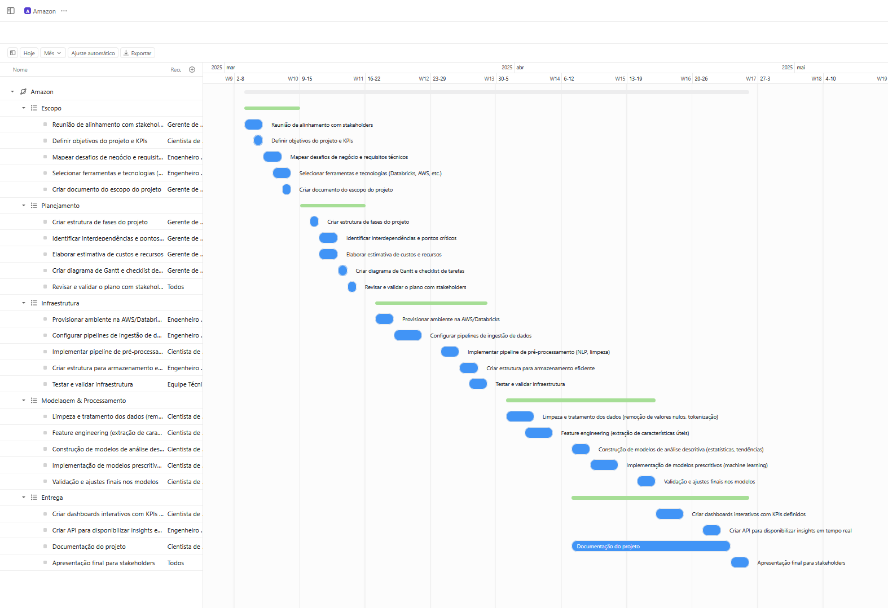
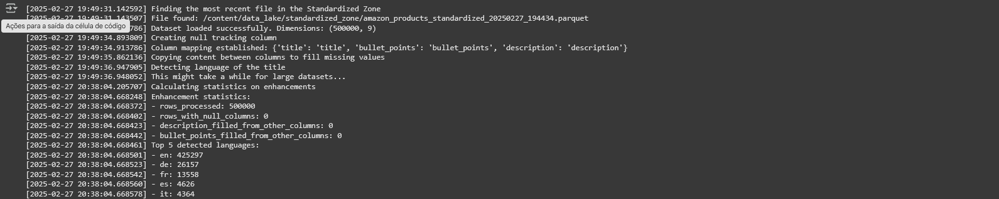

# Dadosfera Tech Case - Alexandre Amorim

[English Version](README.md) | [Versão em Português](README.pt-br.md)

## Project Overview

The client, a large e-commerce company, aims to build a Data Platform to enhance decision-making across all areas of the company. The primary goal is to deliver descriptive and prescriptive analytics with greater agility and lower cost. The calculations and project stages are based on an [Amazon sales dataset](https://www.kaggle.com/datasets/piyushjain16/amazon-product-data) (Item 1).

## Planning (Item 0)

The project planning follows best practices from PMBOK, using a hybrid model between waterfall and agile methodologies to ensure flexibility and governance in implementing the solution.

### Project Phases

1. **Define Scope**
   
   - Alignment meeting with stakeholders  
   - Define project objectives and KPIs  
   - Map business challenges and technical requirements  
   - Select tools and technologies (Databricks, AWS, etc.)  
   - Create project scope document  

2. **Planning**
   
   - Create project phase structure  
   - Identify interdependencies and critical points  
   - Estimate costs and resources  
   - Develop Gantt chart and task checklist  
   - Review and validate the plan with stakeholders  

3. **Infrastructure**
   
   - Provision environment on AWS/Databricks  
   - Configure data ingestion pipelines  
   - Implement preprocessing pipeline (NLP, cleaning)  
   - Create a structure for efficient storage  
   - Test and validate infrastructure  

4. **Modeling & Processing**
   
   - Data cleaning and preprocessing (null value removal, tokenization)  
   - Feature engineering (extracting useful characteristics)  
   - Building descriptive analysis models (statistics, trends)  
   - Implementing prescriptive models (machine learning)  
   - Validation and final adjustments to models  

5. **Delivery**
   
   - Develop interactive dashboards with defined KPIs  
   - Create API to provide real-time insights  
   - Project documentation  
   - Final presentation to stakeholders  

### Project Roadmap (only pt-br)

### Risk Analysis

| Risk | Probability | Impact | Mitigation |
|--------|-------------|---------|------------|
| Lack of integration with legacy systems | High | High | Early planning and compatibility testing |
| Data quality issues | Medium | High | Implementation of data governance processes |
| Delays due to scope changes | High | Medium | Use of agile methodology to absorb changes |
| Resistance from client team | Low | Medium | Conduct detailed training and continuous support |

### Cost and Resource Estimation

To process and analyze the Amazon dataset (2GB of data), we will use **Big Data and Machine Learning optimized services** on GCP, considering a volume of 3GB of data.

### Required GCP Services

| Component                | GCP Service                      | Description                                        | Estimated Cost (USD) |
|---------------------------|----------------------------------|--------------------------------------------------|----------------------|
| **Storage**              | Cloud Storage (Standard Tier)    | Stores 2GB of raw Amazon data                    | $0.00*              |
| **Data Processing**      | BigQuery                         | Serverless data warehouse for SQL analysis       | $56.25              |
| **ETL (Extraction and Transformation)** | Dataflow (Apache Beam)   | Scalable pipeline for data cleaning and processing  | $4.17               |
| **Machine Learning**     | Vertex AI                        | ML model training and inference                  | $69.00              |
| **Orchestration**        | Cloud Composer (Airflow)         | ETL and ML workflow automation                   | $360.31             |
| **Database**             | Firestore (NoSQL)                | Stores structured insights and metrics           | $0.00*              |
| **Data Visualization**   | Looker Studio                    | Interactive dashboards and reports               | Free with BigQuery  |
| **Security**             | IAM, Cloud Logging, KMS          | Access control and auditing                      | Included in free tier |
| **Total**                |                                  |                                                  | **$489.73**         |

*Values below $0.01 due to free tier or rounding.

**Notes:**

- For complete details, see [gcp_costs.csv](gcp_costs.csv) for SKUs, quantities, and technical breakdown.
- All cost calculations were made using the official GCP tool ([Pricing Calculator](https://cloud.google.com/calculator?dl=CjhDaVEyTWpjM09HSTFOUzFqWlRReExUUmhOelF0WW1JMk1TMHhNRFE1TlRnM09HTXlObUlRQVE9PRokRDk2NzFBODAtNDU5NS00MDA2LTgxNEUtQUJGNTlERkJBNUNF)).

### Resource Allocation

| Resource             | Role             | Monthly Cost (BRL) |
|---------------------|--------------------|-------------------|
| Project Manager    | Coordination        | R$ 12,000.00      |
| Data Engineer      | Pipeline and integration | R$ 13,000.00   |
| Data Scientist     | NLP and models      | R$ 14,000.00      |
| BI Analyst        | Dashboards         | R$ 8,000.00       |
| Data Architect    | Solution design    | R$ 16,000.00      |
| **Total**         |                    | **R$ 63,000.00**  |

**Notes:**

- The resource allocation assumes a monthly salary based on 200 working hours, though the actual effort required for this specific project may be lower.

**Total Cost (BRL):**

- Infrastructure: $489.73 × 5.71 = **R$ 2,796.30/month**
- Human Resources: R$ 63,000.00
- **Grand Total**: **R$ 65,796.30/month**

