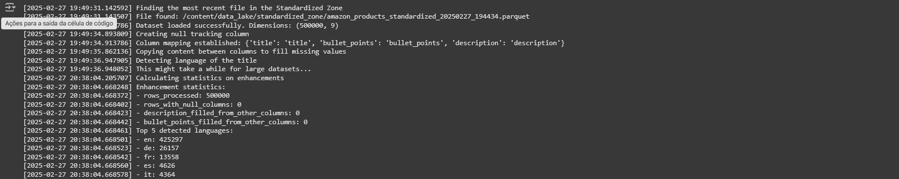

# Dadosfera Tech Case - Alexandre Amorim

[English Version](README.md) | [Versão em Português](README.pt-br.md)

## Visão Geral do Projeto

O cliente, uma grande empresa de e-commerce, busca construir uma Plataforma de Dados para aprimorar a tomada de decisões em todas as áreas da empresa. O objetivo principal é entregar análises descritivas e prescritivas com maior agilidade e menor custo. Foi utilizado como base um [dataset](https://www.kaggle.com/datasets/piyushjain16/amazon-product-data)(item 1) de vendas da Amazon para todo o cálculo de custo e etapas do projeto.

## Planejamento (Item 0)
O planejamento do projeto segue as melhores práticas do PMBOK, utilizando um modelo híbrido entre cascata e ágil, garantindo flexibilidade e governança para a implementação da solução.

### Fases do Projeto
1. **Definir Escopo**
   - Reunião de alinhamento com stakeholders
   - Definir objetivos do projeto e KPIs
   - Mapear desafios de negócio e requisitos técnicos
   - Selecionar ferramentas e tecnologias (Databricks, AWS, etc.)
   - Criar documento do escopo do projeto

2. **Planejamento**
   - Criar estrutura de fases do projeto
   - Identificar interdependências e pontos críticos
   - Elaborar estimativa de custos e recursos
   - Criar diagrama de Gantt e checklist de tarefas
   - Revisar e validar o plano com stakeholders

3. **Infraestrutura**
   - Provisionar ambiente na AWS/Databricks
   - Configurar pipelines de ingestão de dados
   - Implementar pipeline de pré-processamento (NLP, limpeza)
   - Criar estrutura para armazenamento eficiente
   - Testar e validar infraestrutura

4. **Modelagem & Processamento**
   - Limpeza e tratamento dos dados (remoção de valores nulos, tokenização)
   - Feature engineering (extração de características úteis)
   - Construção de modelos de análise descritiva (estatísticas, tendências)
   - Implementação de modelos prescritivos (machine learning)
   - Validação e ajustes finais nos modelos
   
5. **Entrega**
   - Criar dashboards interativos com KPIs definidos
   - Criar API para disponibilizar insights em tempo real
   - Documentação do projeto
   - Apresentação final para stakeholders

### Roadmap do Projeto

### Análise de Riscos
| Risco | Probabilidade | Impacto | Mitigação |
|--------|-------------|---------|------------|
| Falta de integração com sistemas legados | Alta | Alto | Planejamento antecipado e testes de compatibilidade |
| Problemas de qualidade dos dados | Média | Alto | Implementação de processos de governança de dados |
| Atrasos devido a mudanças de escopo | Alta | Médio | Uso de metodologia ágil para absorver mudanças |
| Resistência da equipe do cliente | Baixa | Médio | Realizar treinamento detalhado e suporte contínuo |

### Estimativa de Custos e Recursos

Para processar e analisar a base de dados da Amazon (2GB de dados), utilizaremos serviços **otimizados para Big Data e Machine Learning** na GCP considerando um volume de 3GB de dados.  

### Serviços GCP Necessários  

| Componente                | Serviço GCP                      | Descrição                                        | Custo Estimado (USD) |
|---------------------------|----------------------------------|--------------------------------------------------|----------------------|
| **Armazenamento**         | Cloud Storage (Standard Tier)    | Armazena os 2 GB de dados brutos da Amazon       | $0.00*              |
| **Processamento de Dados**| BigQuery                         | Data warehouse serverless para análise SQL       | $56.25              |
| **ETL (Extração e Transformação)** | Dataflow (Apache Beam)   | Pipeline escalável para limpeza e processamento  | $4.17               |
| **Machine Learning**      | Vertex AI                        | Treinamento e inferência de modelos ML           | $69.00              |
| **Orquestração**          | Cloud Composer (Airflow)         | Automação de workflows ETL e ML                  | $360.31             |
| **Banco de Dados**        | Firestore (NoSQL)                | Para salvar insights e métricas estruturadas     | $0.00*              |
| **Visualização de Dados** | Looker Studio                    | Dashboards e relatórios interativos              | Gratuito com BigQuery |
| **Segurança**             | IAM, Cloud Logging, KMS          | Controle de acessos e auditoria                  | Incluso no plano free |
| **Total**                 |                                  |                                                  | **$489.73**         |

*Valores abaixo de $0.01 devido ao tier gratuito ou arredondamento.

**Notas:**
- Para detalhes completos veja [gcp_costs.csv](gcp_costs.csv) para SKUs, quantidades e breakdown técnico.

- Todo o cálculo foi feito utilizando a ferramenta oficial do GCP ([Pricing Calculator](https://cloud.google.com/calculator?dl=CjhDaVEyTWpjM09HSTFOUzFqWlRReExUUmhOelF0WW1JMk1TMHhNRFE1TlRnM09HTXlObUlRQVE9PRokRDk2NzFBODAtNDU5NS00MDA2LTgxNEUtQUJGNTlERkJBNUNF)).

### Alocação de Recursos

| Recurso             | Função             | Custo Mensal (R$) |
|---------------------|--------------------|-------------------|
| Gerente de Projetos | Coordenação        | R$ 12.000,00      |
| Engenheiro de Dados | Pipeline e integração | R$ 13.000,00   |
| Cientista de Dados  | NLP e modelos      | R$ 14.000,00      |
| Analista de BI      | Dashboards         | R$ 8.000,00       |
| Arquiteto de Dados  | Design da solução  | R$ 16.000,00       |
| **Total**           |                    | **R$ 63.000,00**  |

**Notas:**
- Para o a alocação de recursos está sendo considerado um salário mensal de 200 horas trabalhadas, mas é provável que não utilize todo o HH de cada recurso para esse projeto específico.

**Custo Total (R$)**:  
- Infraestrutura: 489.73 × 5,71 = R$ 2.796,30/mês
- Recursos Humanos: R$ 63.000,00.  
- **Total Geral**: **R$ 65.796,30/mês**.

# Execução

## Passo 1
Foi escolhido um [dataset](https://www.kaggle.com/datasets/piyushjain16/amazon-product-data) de catálogo da Amazon, onde propositalmente encontram-se dados faltantes e inconsistentes, simulando um cenário real de dados brutos. O objetivo é utilizar limpeza, pré-processamento de dados textuais (NLP), extração de features relevantes e análise exploratória para obter insights valiosos sobre os produtos.

A ingestão é feita por API da kaggle [(ingestão)](Cópia_de_dadosfera_case.ipynb#data-ingestion)(item 1) e salvando o csv.

## Passo 2
Carregado o [dataset](https://www.kaggle.com/datasets/piyushjain16/amazon-product-data) vamos fazer a ingestão para os catálagos, começando pela [Landing Zone](Cópia_de_dadosfera_case.ipynb#landing-zone)(item 2) e (item 3) que é feita para armazenar os dados crus, sem tratativas. Também foi realizada a análise descritiva para mapear insights e saúde dos dados.

O próximo catálogo é a [Standardized Zone](Cópia_de_dadosfera_case.ipynb#standardized-zone)

